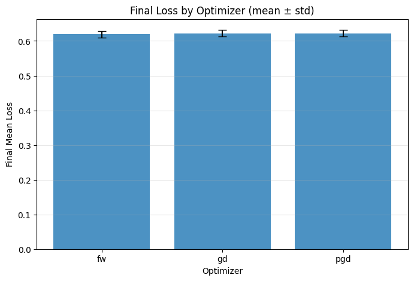
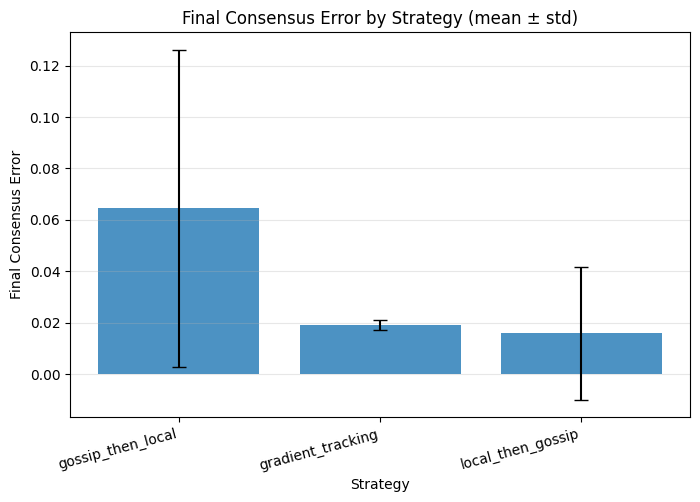
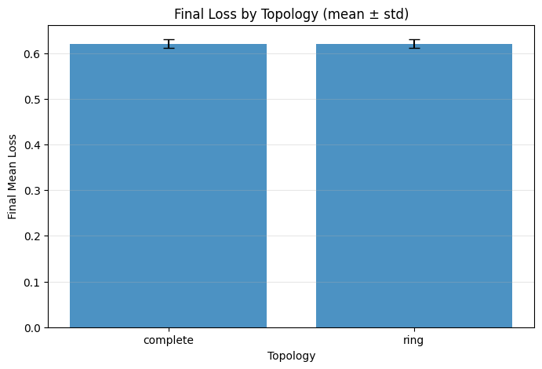
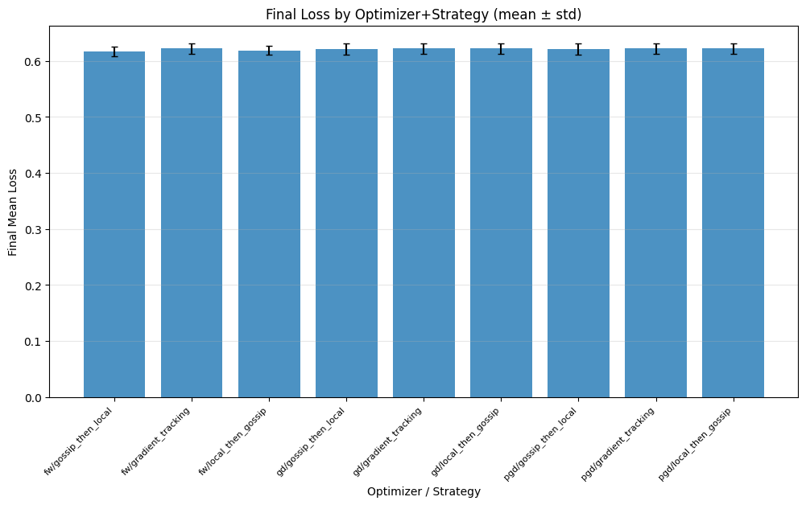

# Matrix Experiment Report

## Overview

- **Number of runs**: 96

## Best Runs

### Best by Final Mean Loss

- **Run ID**: `run_0015`
- **Optimizer**: fw
- **Topology**: ring
- **Strategy**: gossip_then_local
- **Final mean loss**: 0.600941

## Top 10 Runs

| Rank | Run ID | Optimizer | Strategy | Topology | Seed | Mean Loss |
|------|--------|-----------|----------|----------|------|------------|
| 1 | `run_0015` | fw | gossip_then_local | ring | 1 | 0.600941 |
| 2 | `run_0039` | fw | gossip_then_local | complete | 1 | 0.601769 |
| 3 | `run_0007` | fw | local_then_gossip | ring | 1 | 0.604701 |
| 4 | `run_0011` | fw | gossip_then_local | ring | 1 | 0.605381 |
| 5 | `run_0035` | fw | gossip_then_local | complete | 1 | 0.606180 |
| 6 | `run_0031` | fw | local_then_gossip | complete | 1 | 0.607180 |
| 7 | `run_0003` | fw | local_then_gossip | ring | 1 | 0.607325 |
| 8 | `run_0055` | pgd | gossip_then_local | ring | 1 | 0.607964 |
| 9 | `run_0079` | gd | gossip_then_local | ring | 1 | 0.607964 |
| 10 | `run_0067` | pgd | gossip_then_local | complete | 1 | 0.608291 |

## Statistics by Group

### By Optimizer

| Optimizer | Runs | Mean Loss ± Std | Mean Consensus ± Std |
|-----------|------|-----------------|----------------------|
| fw | 48 | 0.6192 ± 0.0091 | 0.0526 ± 0.0562 |
| gd | 24 | 0.6221 ± 0.0096 | 0.0135 ± 0.0072 |
| pgd | 24 | 0.6221 ± 0.0096 | 0.0135 ± 0.0072 |

### By Strategy

| Strategy | Runs | Mean Loss ± Std | Mean Consensus ± Std |
|----------|------|-----------------|----------------------|
| gossip_then_local | 32 | 0.6191 ± 0.0097 | 0.0644 ± 0.0618 |
| gradient_tracking | 32 | 0.6225 ± 0.0093 | 0.0190 ± 0.0019 |
| local_then_gossip | 32 | 0.6204 ± 0.0092 | 0.0158 ± 0.0259 |

### By Topology

| Topology | Runs | Mean Loss ± Std | Mean Consensus ± Std |
|----------|------|-----------------|----------------------|
| complete | 48 | 0.6209 ± 0.0094 | 0.0262 ± 0.0425 |
| ring | 48 | 0.6204 ± 0.0096 | 0.0400 ± 0.0456 |

## Plots

### Final Loss by Optimizer

### Final Consensus Error by Strategy

### Final Loss by Topology

### Final Loss by Optimizer + Strategy

