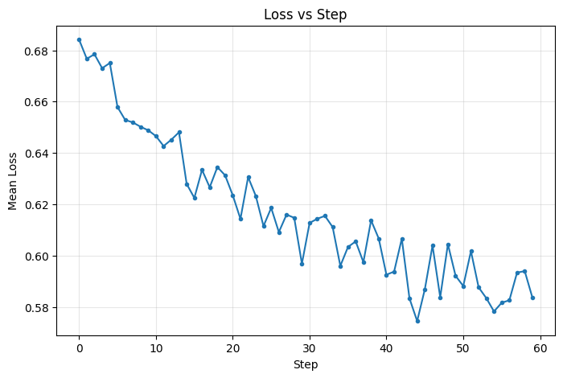
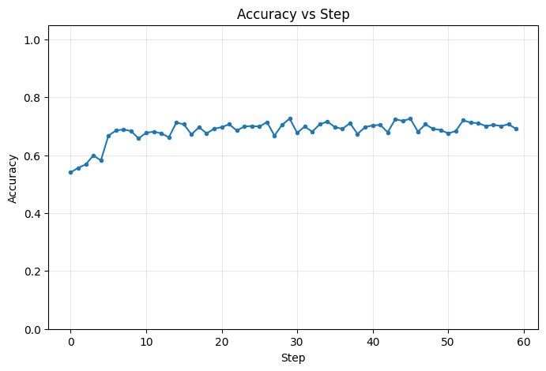
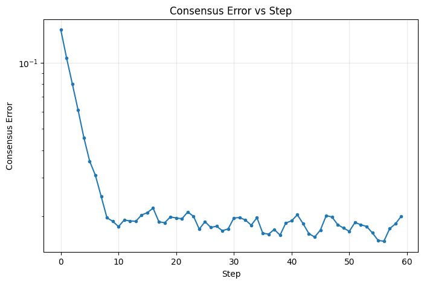

# Experiment Report

## Configuration

- **Environment**: gossip
- **Task**: logistic
- **Optimizer**: gd
- **Steps**: 60
- **Seed**: 0
- **Dimension**: 10
- **Nodes**: 8
- **Topology**: ring
- **Strategy**: local_then_gossip
- **Samples**: 2000
- **Batch size**: 64
- **Heterogeneity**: label_skew

## Final Metrics

- **Final mean loss**: 0.591967
- **Final mean accuracy**: 0.6965
- **Final consensus error**: 0.020023

## Plots

### Loss vs Step

### Accuracy vs Step

### Consensus Error vs Step

## Animation

[View Animation](animation.gif)
