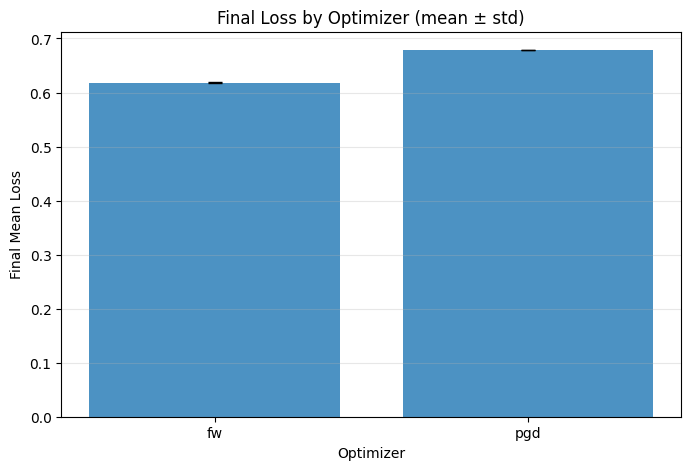
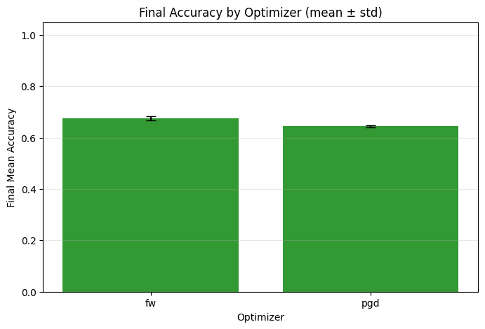
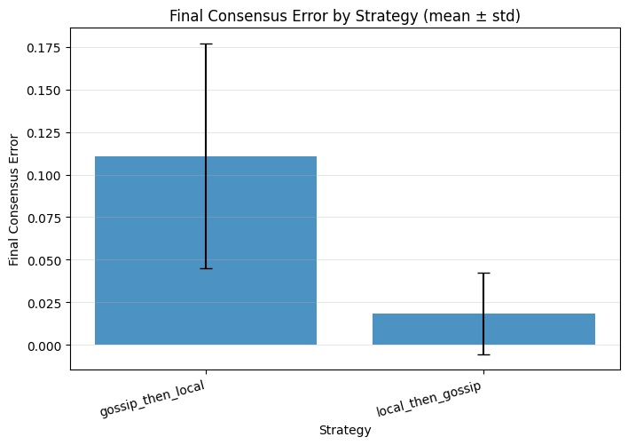
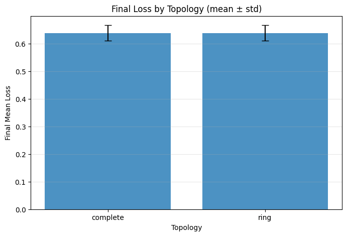
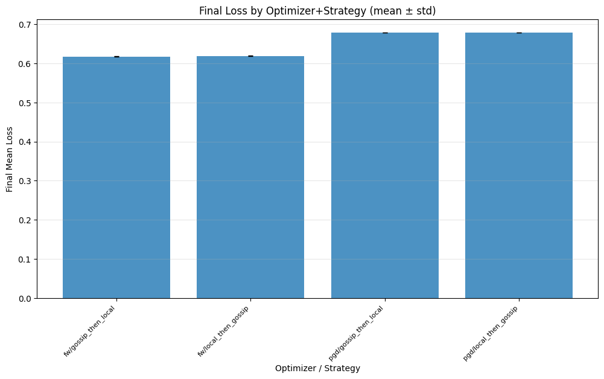

# Matrix Experiment Report

## Overview

- **Number of runs**: 12

## Best Runs

### Best by Final Mean Loss

- **Run ID**: `run_0006`
- **Optimizer**: fw
- **Topology**: complete
- **Strategy**: gossip_then_local
- **Final mean loss**: 0.616440

## Best Run per Optimizer

| Optimizer | Run ID | Model | Constraint | Radius | Topology | Strategy | Accuracy | Loss |
|-----------|--------|-------|------------|--------|----------|----------|----------|------|
| fw | `run_0004` | NumpyVector | l2ball | 1.0 | complete | local_then_gossip | 0.6840 | 0.6179 |
| pgd | `run_0008` | NumpyVector | l2ball | 1.0 | ring | local_then_gossip | 0.6500 | 0.6786 |

## Top 10 Runs

| Rank | Run ID | Model | Optimizer | Strategy | Topology | Seed | Accuracy |
|------|--------|-------|-----------|----------|----------|------|------------|
| 1 | `run_0004` | NumpyVector | fw | local_then_gossip | complete | 0 | 0.6840 |
| 2 | `run_0005` | NumpyVector | fw | local_then_gossip | complete | 0 | 0.6840 |
| 3 | `run_0000` | NumpyVector | fw | local_then_gossip | ring | 0 | 0.6800 |
| 4 | `run_0001` | NumpyVector | fw | local_then_gossip | ring | 0 | 0.6800 |
| 5 | `run_0006` | NumpyVector | fw | gossip_then_local | complete | 0 | 0.6760 |
| 6 | `run_0007` | NumpyVector | fw | gossip_then_local | complete | 0 | 0.6660 |
| 7 | `run_0003` | NumpyVector | fw | gossip_then_local | ring | 0 | 0.6660 |
| 8 | `run_0002` | NumpyVector | fw | gossip_then_local | ring | 0 | 0.6640 |
| 9 | `run_0008` | NumpyVector | pgd | local_then_gossip | ring | 0 | 0.6500 |
| 10 | `run_0009` | NumpyVector | pgd | gossip_then_local | ring | 0 | 0.6460 |

## Statistics by Group

### By Optimizer

| Optimizer | Runs | Mean Loss ± Std | Mean Consensus ± Std |
|-----------|------|-----------------|----------------------|
| fw | 8 | 0.6181 ± 0.0010 | 0.0918 ± 0.0685 |
| pgd | 4 | 0.6783 ± 0.0002 | 0.0104 ± 0.0077 |

### By Strategy

| Strategy | Runs | Mean Loss ± Std | Mean Consensus ± Std |
|----------|------|-----------------|----------------------|
| gossip_then_local | 6 | 0.6377 ± 0.0286 | 0.1110 ± 0.0661 |
| local_then_gossip | 6 | 0.6387 ± 0.0282 | 0.0184 ± 0.0240 |

### By Topology

| Topology | Runs | Mean Loss ± Std | Mean Consensus ± Std |
|----------|------|-----------------|----------------------|
| complete | 6 | 0.6380 ± 0.0285 | 0.0558 ± 0.0732 |
| ring | 6 | 0.6383 ± 0.0283 | 0.0736 ± 0.0610 |

## Plots

### Final Loss by Optimizer

### Final Accuracy by Optimizer

### Final Consensus Error by Strategy

### Final Loss by Topology

### Final Loss by Optimizer + Strategy

## Animations

See [animations.md](animations.md) for animated visualizations of the top 2 runs.
