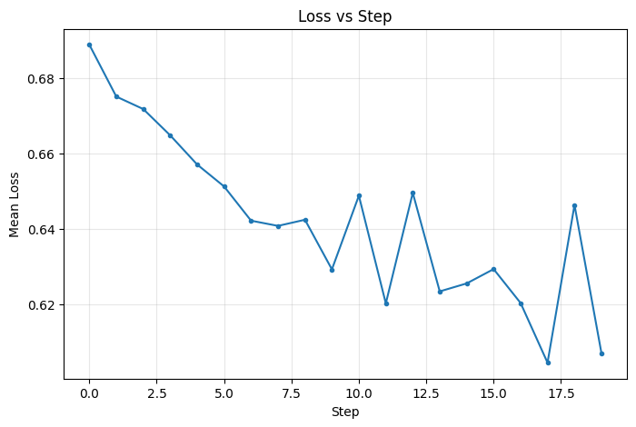
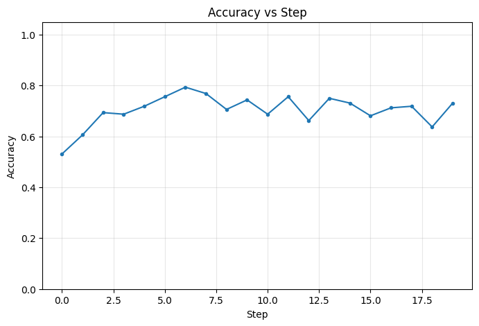

# Experiment Report

## Configuration

- **Environment**: gossip
- **Task**: logistic
- **Optimizer**: gd
- **Steps**: 20
- **Seed**: 42
- **Dimension**: 5
- **Nodes**: 5
- **Topology**: ring
- **Strategy**: local_then_gossip
- **Samples**: 500
- **Batch size**: 32
- **Heterogeneity**: label_skew

## Final Metrics

- **Final mean loss**: 0.615637
- **Final mean accuracy**: 0.7120
- **Final consensus error**: 0.010110

## Plots

### Loss vs Step

### Accuracy vs Step

### Consensus Error vs Step

## Animation

[View Animation](animation.gif)
