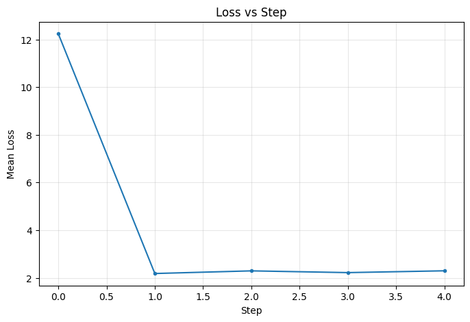
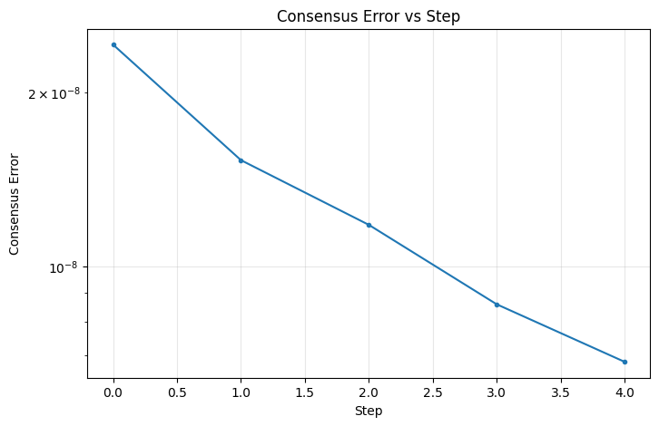

# Experiment Report

## Configuration

- **Environment**: gossip
- **Task**: mnist
- **Optimizer**: adam
- **Steps**: 5
- **Seed**: 0
- **Dimension**: N/A
- **Nodes**: 3
- **Topology**: ring
- **Strategy**: local_then_gossip

## Final Metrics

- **Final mean loss**: 2.294452
- **Final mean accuracy**: 0.1000
- **Final consensus error**: 0.000000

## Plots

### Loss vs Step

### Consensus Error vs Step

