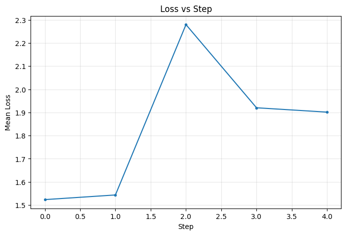

# Experiment Report

## Configuration

- **Environment**: single
- **Task**: mnist
- **Optimizer**: adam
- **Steps**: 5
- **Seed**: 0
- **Dimension**: N/A

## Final Metrics

- **Final mean loss**: 2.256064
- **Final mean accuracy**: 0.1875

## Plots

### Loss vs Step

